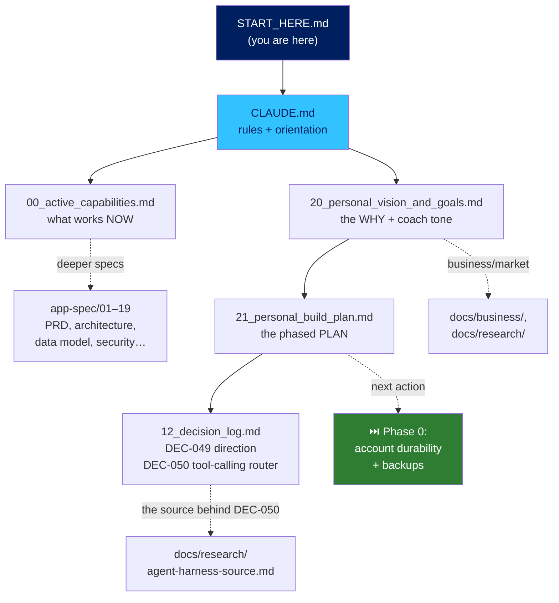

# 🗺️ START HERE — Reading Map for a New Claude Session

> You are picking up an existing, real project. Read this file top to bottom
> first. It tells you what Azdal is, what to read and in what order, and — most
> importantly — **what the next action is**. Do not start editing code or
> proposing work until you've read the five files in the path below.

## TL;DR (if you read nothing else, read this)

- **What it is:** Azdal (أزدل) — a Saudi-Arabic-dialect financial coach. You ask
  it "هل أقدر أشتري؟" (can I afford this?) in plain dialect; it gives a yes/wait/no
  verdict from your real income, commitments, spending, and goals. Tagline: **من
  مديون... إلى مستثمر** (from indebted to investor).
- **State:** Stage 4 done and device-verified; the AMAD hackathon shipped. CI is
  green, an APK builds automatically.
- **The next phase (this is the real work now):** a permanent, chat-only
  **personal build** for the founder's own financial life. His real turnaround —
  saving, an emergency fund, changed habits — is the definition of "done."
- **⏭️ THE IMMEDIATE NEXT ACTION:** convert the founder's account from anonymous
  to a permanent email-linked account, and set up backups. It protects real data
  that already exists and is independent of everything else. (Personal-build
  Phase 0 — see file #4 below.)
- **The one rule you must never break:** the LLM never does financial math. All
  arithmetic is pure Dart in the service layer. A number the model produced is a
  bug. (More guardrails at the bottom.)

## 📖 Read these five, in this exact order — then stop

| # | File | Why you read it | What you'll know after |
|---|------|-----------------|------------------------|
| 1 | **`CLAUDE.md`** | The anchor: identity, the 5 non-negotiable rules, where truth lives | How to work here without breaking things |
| 2 | **`app-spec/00_active_capabilities.md`** | The accurate, current status of every feature | What actually works today vs. what's mock or planned |
| 3 | **`app-spec/20_personal_vision_and_goals.md`** | The founder's real why, goals, and the coach's required tone | *Why* this exists and how to talk — to the coach's user AND to the founder |
| 4 | **`app-spec/21_personal_build_plan.md`** | The phased plan (Phase 0 → 0.5 → 1–3) | Exactly what to build, in what order, and why |
| 5 | **`app-spec/12_decision_log.md`** — read **DEC-049** and **DEC-050** first, skim the rest | The two forward-looking decisions + the full "why is it like this" archive | The personal-build direction and the tool-calling-router plan |

After those five you understand the project. For anything deeper, the map below
tells you where to go.

## 🧭 The map — how the documents relate

**How to use the rest of `app-spec/`:** files `01`–`19` are the deep spec pack
(PRD, Flutter architecture, data model, security, etc.). You don't read them
front-to-back — you open the one relevant to the task in hand. `00_*` files are
the always-relevant overview/status ones.

## ⏭️ Your next step, concretely

1. Confirm you've read files 1–5 above.
2. The first real work item is **Phase 0** in `21_personal_build_plan.md`:
   **account durability** — convert the founder's anonymous Supabase account to a
   permanent email-linked one (same UUID, zero data migration — see DEC-017), and
   set up backups (PITR if the plan allows, else a scheduled `pg_dump`).
3. Everything else in the plan (BNPL decisions, forecasting, the tool-calling
   router in Phase 0.5, emergency fund, etc.) comes *after* durability. Don't
   reorder it without a reason — the sequence is deliberate and explained in the
   plan.
4. Before touching anything load-bearing, check `12_decision_log.md` so you don't
   re-break something a DEC already solved.

## 🚧 Guardrails — do not break these (from CLAUDE.md, repeated so you can't miss them)

1. **The LLM never computes.** All financial math is pure Dart. (DEC-024)
2. **No hard delete.** Soft-delete only (`is_deleted`/`deleted_at`). (DEC-010)
3. **Verify on a real device against the real database.** "Tests pass" ≠ "it
   works." Every real bug here was found by driving the app, not static analysis.
   (LL-010/011)
4. **Guest-first, anonymous-first.** Real accounts are an in-place upgrade of the
   same identity. (DEC-017)
5. **Talk to the founder blunt and numbers-first, never flattering** — and the
   coach must be honest but **never gloat** after advice is ignored.
   (`20_personal_vision_and_goals.md`)
